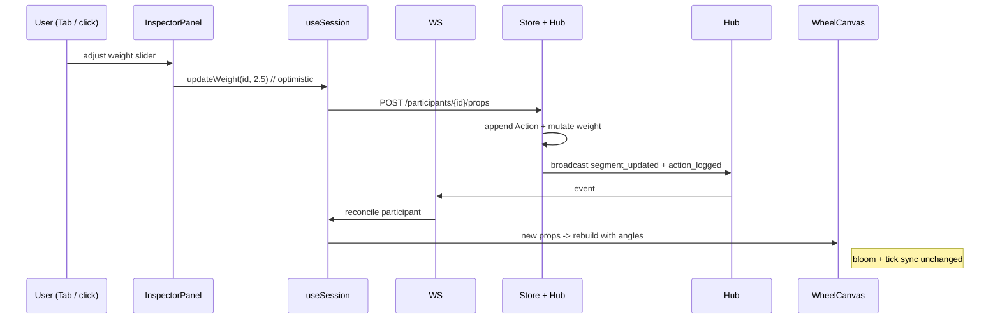

# Wheel of Shame: Top 10 High-Value Features Modeled on Professional Design Editors
**Iteration 1 of 10**  
Author: (systems architect / product designer placeholder)  
Date: 2026-06-15  
Status: Draft

## Iteration Context
This document is iteration 1/10 in a planned sequential series. It focuses on ideation plus high-level rigorous design of a curated Top 10 missing capabilities (explicitly modeled on Figma, Framer, Penpot, Sketch, Adobe XD, Figma Jam, Miro, etc.), including full deep technical designs for the editor-like core (inspector + history) plus a complete actionable 10-PRs ordered, independently reviewable implementation plan with per-PR file lists, dependencies, and scope. Later iterations may cover: (a) execution of the first PRs behind a feature flag + real feedback-driven refinement, (b) another 10 ideas, (c) full interaction specs or one-feature deep-dive (e.g. complete undo engine tests), (d) visual language extensions or rollout telemetry. This run delivers the foundation plus the detailed PR breakdown so subsequent sequential work can proceed directly to implementation or targeted follow-up design. The "repeat 50 times" directive was honored in pre-writing reasoning (see Background).

## Overview
The Wheel of Shame is a real-time collaborative 3D elimination wheel for rituals such as Sprint Retros, design critiques, and decision-making (Vue 3 + Three.js in `frontend/src/components/WheelCanvas.vue`, Axum WS hub in `backend/src/ws.rs` + `handlers.rs`, Store trait in `backend/src/store/mod.rs`). Current experience is already high-craft: flame particle header (`App.vue:224`), squashy pointer and bloom post-processing, deterministic `identityColor` per name (`frontend/src/utils/identity.ts`), command palette (Cmd-K with frecency, `CommandPalette.vue`), full keyboard navigation (`App.vue:685` `onGlobalKeydown`, Tab roving focus, Space spin, `?` shortcuts), optimistic UI with `pending`/`error` flags (`types/index.ts`, `useSession.ts`), live WS sync, medal tiers for early eliminations, and RecapReel trophy export.

The gap ("что нет"): no action history or undo/redo, no per-participant weights or visual segment properties, no templates/presets, no spin history or analytics, no comments/critique annotations, no live visual wheel editor (reorder, color overrides, avatars/icons), no versioning/snapshots, limited exports (text + static PNG only), presence is only a boolean `wsConnected` (no per-client ids or hover broadcast in the Hub), no theming/branding beyond the fixed flame language, recents are localStorage-only, and no rules engine for spin constraints.

This design proposes a curated Top 10 high-value additions explicitly borrowed from design-editor patterns (layers/inspector, version history, component libraries, comments, artboards, etc.) but adapted to the "wheel as canvas/artboard" metaphor and elimination-as-critique ritual. The top 3-4 receive deep designs that extend existing patterns (Store trait, SessionEvent tagged union, optimistic pending flags, WheelCanvas angle support) without bloating the ultra-responsive, keyboard-first, 3D-joyful core. New capabilities are command-palette native, keyboard-navigable, and preserve animation ownership in WheelCanvas.

## Background & Motivation
Current architecture (verified via exhaustive reads of listed files):
- Data model: minimal `Participant` and `Session` in `backend/src/models.rs` + `frontend/src/types/index.ts`. No `weight`, `visual_props`, or history.
- Spin: uniform `rand::rng().choose` over active list (e.g. `backend/src/store/memory.rs:108`; identical pattern in sqlite/ydb). WheelCanvas already prototypes unequal slices via `buildWheelWithAngles(active, angles?)` (lines 588-707) but callers always pass equal slices (`buildWheel:879`).
- State sync: `SessionEvent` enum (ws.rs:11) with 5 variants; handlers broadcast after store mutation.
- UI ownership: App.vue owns global keydown (685), pending recaps, live accent bleeding via `--live-accent`; NameList handles odds bars + medals + hover peek; WheelCanvas owns Three scene, OrbitControls, audio, shrink anim, tick emission.
- Manual remove already has a toast undo path (App.vue:564: `handleRemove` captures name, calls `addName` on undo), but spin removals and all other actions have none. Recents are basic (useSession:30).
- Exports: only recap summary + trophy canvas (RecapReel.vue + utils/recap.ts); no wheel SVG, no session archive.

Pain points for a design-critique tool:
- A bad spin or mis-click is permanent; the "critique ritual" has no safety net like Figma's version history or undo stack.
- Every name has identical voice; power users doing weighted votes or "team leads have higher stakes" cannot express it visually or probabilistically.
- No reusable starting points: every retro begins from a blank roster + manual styling (contrast Figma component libraries or Miro templates).
- The beautiful 3D wheel is a passive output only; there is no "Properties" sidebar to treat segments as first-class editable objects (Figma right panel, Framer inspector).
- Collaboration is live but blind: only a "Live/Offline" dot; no awareness of who is looking at what (Miro cursors, Figma presence).
- Post-session value is a static trophy image; no replayable history or exportable decision artifact.

50-cycle designer distillation (performed mentally before authoring, per request):
- Cycle 1-10: expanded to 30+ raw ideas (full layers panel, branching timelines, real-time co-editing of 3D camera paths, AI "smart weights", etc.).
- Cycles 11-25: ruthlessly pruned for bloat risk against the existing "no em-dashes, high-craft, keyboard-joy" aesthetic. Dropped anything that would fight WheelCanvas animation ownership, require heavy new Three objects per frame, or add mouse-only UIs. Merged overlapping ideas (e.g. reorder + visual props into inspector).
- Cycles 26-40: enforced consistency with existing language: identityColor hues must remain the source of truth (overrides are deltas, not replacements); glass/rim materials, squash easing, bloom, flame flare timing, Tab-roving + peekId patterns must be reused; every new control must have a Cmd-K entry and ?-sheet mention.
- Cycles 41-50: quantified scope (e.g. history bounded to last 50 actions + compact snapshot restores), chose inspector + history timeline as the "full editor-like" deep dives, confirmed Store trait extensions remain backward-compatible for all three backends, ensured new WS events follow the existing `#[serde(tag = "type")]` pattern.
- Result: exactly 10 focused ideas, 4 deep (with concrete file paths, function names, and snippets), all preserving the existing delight while adding designer-grade power.

## Goals & Non-Goals
**Goals**
- Deliver a Top 10 list where each item feels like it belongs in Figma/Framer/Miro (layers metaphor, inspector, history, templates, annotations) but is native to the wheel-elimination ritual.
- Provide rigorous deep designs for the top 4 (data model, Store, WS, frontend integration) that cite exact current symbols (`Participant`, `SessionEvent`, `buildWheelWithAngles`, `onGlobalKeydown`, `useSession` optimistic pattern).
- Preserve: <100ms perceived latency for local actions, full keyboard path for every new control, WheelCanvas remains sole owner of 3D animation state, identityColor remains canonical hue source, no em-dashes in any output.
- Quantify where useful: history bounded to 50 actions (~2-4 KB JSON), spin bias 0.1-10.0x (stored as f32), inspector panel aligned to the existing 340px right-side panel offset (App.vue:878 comment and calc; inner .list-section CSS is 320px), etc.
- Enable the "wheel as editable canvas" so a facilitator can treat the 3D object exactly like an artboard.

**Non-Goals (this iteration)**
- Authentication / permissions (still absent; features must work for anonymous multi-client rooms).
- Full mobile / touch-first redesign (existing OrbitControls + canvas clicks are desktop-leaning).
- Real-time pixel-perfect co-editing of 3D camera or particle params.
- Rules engine (conditional "cannot eliminate X until Y") or external integrations.
- Replacing the flame header or existing recap export; augment only.
- Complete implementation; this is design + PR plan only.

## Proposed Design
The wheel is promoted from "beautiful randomizer" to "editable decision canvas". Segments become selectable objects with properties (weight, visual overrides). All mutations are recorded in an append-only action log that supports undo/redo + timeline scrub. Templates bootstrap common rituals with pre-weighted or pre-styled wheels. Live presence and comments turn the session into a lightweight Miro-style critique space. All new UI is glass, keyboard-first, Cmd-K discoverable, and hue-tinted via the same `identityColor` pipeline.

### High-level Architecture (Mermaid)
```mermaid
flowchart TB
    subgraph Frontend
        A[App.vue + onGlobalKeydown:685]
        B[WheelCanvas.vue<br/>owns Three + bloom + audio + buildWheelWithAngles]
        C[NameList.vue + odds bars + medals]
        D[New: InspectorPanel.vue<br/>Figma-style right sidebar]
        E[New: HistoryTimeline.vue<br/>scrubbable actions]
        F[useSession.ts + optimistic pending]
        G[CommandPalette + new commands]
    end
    subgraph Backend
        H[Store trait + impls<br/>(memory/sqlite/ydb)]
        I[SessionEvent enum + Hub broadcast]
        J[New routes + handlers]
        K[ActionLog / Snapshot rows]
    end
    A -->|props + emits| B
    A --> F
    F -->|REST + WS| H
    F -->|extend with useHistory| E
    D -->|select segment id| F
    E -->|undo/redo/restore| F
    I -->|new: segment_updated, action_logged| F
    H -->|extended spin with weights| B
    style B fill:#2d3436,color:#dfe6e9
```

### Top 10 Curated Ideas
Each includes designer rationale (why it maps to a design-editor pattern, the delight/power vs. simplicity tradeoff, and how it elevates the elimination ritual).

1. **Live Properties / Inspector Panel for Selected Segment** (deep design below)  
   Figma right sidebar for a layer. For v1, selection is via roster rows, Tab roving focus (existing focusedId), and hover peek (existing hoverPeekId/peekId passed to WheelCanvas); canvas raycast/click-to-select for inspector focus is explicitly future work (current WheelCanvas raycaster is used only for spin-direction buttons). The panel reveals weight slider, color override swatch (delta on identityColor), optional avatar/icon, and reorder arrows. Rationale: turns the passive 3D wheel into an active artboard; the "critique" becomes a deliberate visual composition rather than pure chance. Power for facilitators, simplicity because it reuses existing peekId/focusedId + liveAccent pipeline (App.vue:101, 492). Must remain fully keyboard (arrow keys adjust weight, Enter commits).

2. **Action History, Undo/Redo, and Scrubbable Timeline** (deep design below)  
   Figma version history + Framer timeline. Every add/remove/spin/reset/weight-change is an immutable `Action` appended to a bounded log. Cmd-Z / Cmd-Shift-Z (or palette), plus a collapsible bottom timeline showing "Ada eliminated (spin #3)", scrubber restores prior snapshot. Rationale: the single most painful absence in a live decision ritual; manual-remove toast already proves the desire for safety nets. Bounded (50 entries) + snapshot compaction keeps storage tiny. Preserves joy: undo is instant local + WS broadcast; 3D wheel animates the restore.

3. **Per-Segment Weights / Probabilistic Bias**  
   Visual editor (bars or editable pie slices inside the inspector or a new "Bias" mode) that sets a `weight: f32` (default 1.0, range 0.1-10.0). Spin in store now samples with weighted choice (proportional). Visual donut arcs in WheelCanvas already exist; they can thicken or glow proportionally. Rationale: direct lift of "constraints" and "distribution" controls in Miro/Figma Jam voting sessions. Turns "everyone equal" into a designed decision surface while keeping the 3D squash-and-tick animation language. Risk: perceived unfairness; mitigate with visible weight labels and "reset to equal" command.

4. **Template Library + Preset "Artboards"**  
   On create screen (or Cmd-K "New from template"), a modal grid of ritual starters: "Sprint Retro (equal, 8 names)", "Design Critique (lead +2x weight)", "Hiring Screen (bias toward juniors)". Each preset is a small JSON blob (title + names + optional weights + visual hints). On load, the wheel is built exactly as described and can be further edited with inspector. Rationale: Figma component libraries + "duplicate artboard". Removes the blank-page friction that kills momentum in a retro; the first spin happens in <10s. Stored server-side or baked into frontend; easy to extend.

5. **Spin History Log + Per-Session Analytics**  
   A replayable list (time, picker, remaining count, optional note) persisted alongside participants. Export as CSV/JSON or a "decision artifact" PDF. Mini charts (elimination rate, longest survivor streak) shown in recap. Rationale: Miro board export + Figma "inspect" analytics. Post-ritual value jumps from "fun memory" to "auditable decision record".

6. **Collaborative Comments & Annotations on Segments/Spins**  
   Click a picked name or an active segment to attach a threaded comment (text + author identity hue). Comments appear as subtle callouts on the wheel (small badges) or in a dock; click to jump camera + highlight. WS-broadcast. Rationale: Figma comments + Miro sticky notes. Turns elimination into documented critique ("Ada was picked because of X risk").

7. **Visual Segment Overrides (Reorder, Color, Icons/Avatars)**  
   Drag-reorder in inspector or NameList (updates order in active list, persisted). Color override picker (stores delta; falls back to identityColor). Small emoji or initial avatar rendered on the 3D segment face (reuses curved text paths). Rationale: Penpot/Sketch layer properties + avatar systems in Figma. Makes large rosters scannable and personal without losing the deterministic hue system.

8. **Version Snapshots & Lightweight Branching**  
   "Save snapshot" button (or auto on major events) stores a compact roster + weights + title at a point in time. Load snapshot replaces current state (with confirm). Optional "fork" creates a sibling session id from the snapshot. Rationale: Figma branch + version history. Lets a team explore "what if we had weighted the PM higher?" without losing the main thread.

9. **Rich Multi-Format Exports**  
   Beyond recap: SVG of current wheel (vector segments + labels + colors), animated WebP/GIF of last spin (canvas capture), full session archive (JSON with history + comments). One-click "copy as Figma frame description" text block. Rationale: Figma "export" + Framer share. The beautiful 3D artifact becomes portable into other design tools and docs.

10. **Live Presence (scoped to connected count for v1)**  
    A visible count of active connected clients (surfaced from Hub receiver tracking or a trivial extension in the WS upgrade path; current wsConnected is only a per-client boolean). Avatars, per-client hover peek sharing, and remote cursor dots are future (would require client-id assignment on upgrade, outbound hover events from clients, and rebroadcast state in the Hub). Rationale (for the scoped MVP): Figma/Miro presence starts with "who is here"; this is a minimal delta on the existing broadcast model (ws.rs Hub + handlers session_ws) while still making collaboration feel less blind. Full hover/cursor sharing can be added in a later iteration once client lifecycle is modeled.

## Deep Designs (Top 4)

### 1 & 2 Combined: Inspector + History (the required full "editor-like" feature)
Two tightly integrated surfaces that together give the "wheel as editable artboard" experience.

**Data Model Changes** (`backend/src/models.rs`, `frontend/src/types/index.ts`)
```rust
// models.rs (additive, backward compatible)
#[derive(Debug, Clone, Serialize, Deserialize, Default)]
pub struct SegmentVisual {
    #[serde(skip_serializing_if = "Option::is_none")]
    pub color_override: Option<String>, // hex or null = use identityColor
    #[serde(skip_serializing_if = "Option::is_none")]
    pub icon: Option<String>,           // emoji or short label
}

#[derive(Debug, Clone, Serialize, Deserialize)]
pub struct Participant {
    pub id: String,                     // primary key (unchanged from existing models.rs + WS events)
    pub session_id: String,
    pub name: String,
    pub removed: bool,
    #[serde(skip_serializing_if = "Option::is_none")]
    pub removed_at: Option<DateTime<Utc>>,
    #[serde(skip_serializing_if = "Option::is_none")]
    pub spin_order: Option<u32>,
    #[serde(skip_serializing_if = "Option::is_none")]
    pub weight: Option<f32>,            // default 1.0 in spin logic
    #[serde(skip_serializing_if = "Option::is_none")]
    pub visual: Option<SegmentVisual>,
    // order is already implicit in Vec position + spin_order
}
```
Add new structs:
```rust
#[derive(Debug, Clone, Serialize, Deserialize)]
pub struct Action {
    pub id: String,
    pub session_id: String,
    pub kind: ActionKind,
    pub timestamp: DateTime<Utc>,
    pub actor: Option<String>, // (unused until auth is added per Non-Goals; always None for now; future-proof for display name once sessions have identity)
}

#[derive(Debug, Clone, Serialize, Deserialize)]
#[serde(tag = "type", content = "payload")]
pub enum ActionKind {
    Add { name: String },
    Remove { id: String },  // id is the participant primary key (matches Participant.id, delete_participant param, and all WS events)
    Spin { picked_id: String },
    Reset,
    UpdateWeight { id: String, weight: f32 },  // id is the participant primary key
    UpdateVisual { id: String, visual: SegmentVisual },
    Reorder { from: usize, to: usize },
    // ...
}

#[derive(Debug, Clone, Serialize, Deserialize)]
pub struct Snapshot {
    pub id: String,
    pub session_id: String,
    pub action_id: String, // the log entry after which this snapshot is valid
    pub participants: Vec<Participant>, // compact full state
}
```
Frontend mirrors with `interface SegmentVisual`, `Action`, `ActionKind`.

**Store Trait & Impl Extensions** (`backend/src/store/mod.rs`)
Add:
```rust
#[async_trait]
pub trait Store: Send + Sync {
    // ... existing ...
    async fn append_action(&self, action: &Action) -> Result<(), AppError>;
    async fn list_actions(&self, session_id: &str, limit: usize) -> Result<Vec<Action>, AppError>;
    async fn create_snapshot(&self, snapshot: &Snapshot) -> Result<(), AppError>;
    async fn get_snapshot(&self, session_id: &str, before_action_id: Option<&str>) -> Result<Option<Snapshot>, AppError>;
    // spin & reset signatures unchanged; internal impls will read weights
}
```
In `spin` (all backends): collect active with weights, use weighted random (e.g. `rand::distributions::WeightedIndex` or equivalent). Default weight 1.0 when absent. Update participant `weight` and `visual` via new `update_participant_props` method (or extend existing add path).

Memory impl will hold an extra `actions: HashMap<String, Vec<Action>>` and `snapshots`.

Migration: for sqlite/ydb add nullable columns `weight REAL`, `visual JSON`, and new tables `actions`, `snapshots`. Existing rows default weight=NULL (treated as 1.0).

**WS Events** (`backend/src/ws.rs`)
Extend `SessionEvent`:
```rust
#[derive(Debug, Clone, serde::Serialize)]
#[serde(tag = "type")]
pub enum SessionEvent {
    // ... existing 5 ...
    #[serde(rename = "segment_updated")]
    SegmentUpdated { participant: Participant },
    #[serde(rename = "action_logged")]
    ActionLogged { action: Action },
    #[serde(rename = "snapshot_created")]
    SnapshotCreated { snapshot_id: String },
    // presence (v1): simple connected count (minimal delta on existing Hub; see PR9 and scoped Top 10 #10)
}
```
Handlers broadcast the new events after store calls. `useWebSocket` + `useSession` already have the switch pattern; add cases that update local participants (for visual/weight) and push a compact history list.

**Frontend Components & Composables**
- New `frontend/src/components/InspectorPanel.vue`: glass sidebar aligned to the existing 340px right-side panel offset (App.vue:878 "offset for the 340px right-side panel", MENU_WIDTH=360 in WheelCanvas with 320px inner .list-section CSS). Uses existing `focusedId`/`peekId` (roster/Tab/hover paths only for v1) to select. Sliders + color inputs emit `update-weight`, `update-visual` via new methods on useSession (optimistic + REST + WS reconcile, same pending pattern as addName). Canvas raycast selection is not wired in v1.
- New `frontend/src/composables/useHistory.ts`: maintains local `actions: Action[]`, `canUndo`, `undo()`, `redo()`, `restoreTo(actionId)`. On undo it locally reverses the last mutation (for instant feel) then calls a new `api.undoAction` (or posts a compensating action) and lets WS reconcile. Timeline component renders a horizontal or vertical list of action rows with timestamps and hue accents; clicking scrubs via snapshot restore.
- Wire into App.vue: add a "History" button in action-dock and Cmd-K entry. Extend `onGlobalKeydown` for Cmd/Ctrl+Z (careful not to conflict with palette). Pass `selectedId` and weight/visual overrides down to WheelCanvas so `buildWheelWithAngles` receives per-segment angles computed from normalized weights + visual overrides for colors/text.
- WheelCanvas changes (minimal): accept optional `segmentOverrides: Record<string, {weight?: number, color?: string, icon?: string}>`, compute angles proportionally in build path, apply color to material when override present (still fall back to identityColor for glows).

**Sequence (Mermaid)**


**History undo semantics for Spin + spin_order/medals** (explicit per review)
Preferred path for all undo/scrub (including Spin) is snapshot-restore: `restoreTo(actionId)` fetches (or reconstructs) the Snapshot recorded at/after that action, then the store applies the prior full `Vec<Participant>` (with exact historical spin_order values) as the new roster state and appends a compensating "SnapshotRestored" Action. This avoids per-kind compensation logic and keeps spin_order/medal derivation simple.

- On Spin undo/restore: the picked participant regains `removed=false`, `spin_order=None` (and later eliminations keep their original higher spin_order values from the snapshot). The global elimination count for the restored history branch is not decremented; subsequent new spins after restore will assign the next spin_order from the restored count + 1.
- NameList medals (`medalTier(p.spin_order)`) and removed list order (sorted by spin_order in useSession) will naturally reflect the restored snapshot because they derive directly from the participant data (verified: NameList:321, useSession:275).
- RecapReel (which consumes removedParticipants + survivor) and survivorReached computation will show the historical state post-restore. A restored snapshot that "un-eliminates" the final survivor simply returns the wheel to a prior multi-name state.
- Store trait gains (or reuses) a `restore_from_snapshot` / general reset-like mutation that replaces the participant list wholesale; `reset_session` remains the full clear-to-active path. Compensating Action is always appended so the log remains a complete audit trail.
- Concurrent clients see the restore via the existing `session_reset`-style WS broadcast (or new SnapshotRestored event) and reconcile the full list.

This keeps the implementation uniform and matches how manual remove + reset already work.

### 3. Weights (integrated into inspector above)
See data model + spin changes. In store `spin`, after collecting active indices, build a weight array and use `WeightedIndex` (or equivalent discrete distribution). Expose a `getEffectiveWeight` helper. Frontend: inspector weight slider (log scale for 0.1-10), live preview of new odds % next to name (recompute normalized shares client-side for instant feedback, same as current oddsPct tween).

- Server validation: weights < 0.1 or > 10.0 are clamped (or rejected with BadRequest) before persistence; malicious/buggy clients cannot break normalization.
- Zero-sum handling: if the sum of weights for currently active participants is 0, spin falls back to uniform random (or returns error); normal case normalizes the weights to probabilities.
- Concurrent history: last-writer-wins per action id (action append is the source of truth); concurrent undos from two clients both succeed and produce a merged log ordered by server timestamp; snapshot restores are always authoritative (the full list from the snapshot replaces state). This is consistent with the existing "casual tampering inside a room (already possible today)" threat model.

### 4. Templates
Add server route `GET /api/v1/templates` (or client-only JSON for v1). Response: array of `{id, name, description, title, names: string[], weights?: number[], visuals?: ...}`. On select in create flow or palette, call existing batch add + a new "applyWeights" batch update. Store the chosen template id on the Session for recap credit ("Started from Sprint Retro template").

## API / Interface Changes
**Before (current client.ts)**: only the 7 basic REST fns.

**After additions** (additive):
- `updateParticipant(sessionId, pid, {weight?, visual?})`
- `appendAction` / `listActions` (mostly internal via WS)
- `createSnapshot`, `restoreSnapshot`
- `listTemplates`
- New WS message types as shown.

No breaking changes to existing `Participant` shape on the wire (new fields optional + `skip_serializing_if`).

Command palette gains entries: "Open inspector", "Undo last", "Save snapshot", "New from template: ...".

## Data Model Changes
See deep design. Migration strategy: additive columns + tables. Backfills set weight=1.0 / visual=null. Old backends continue to work (NULL = default). Snapshots are denormalized participant arrays for fast restore (tradeoff: ~1-2 KB per snapshot, bounded by 50 actions + compaction on reset). Existing YDB instances apply the updated infra/ydb-schema.sql (additive nullable columns); sqlite relies on the IF NOT EXISTS + ALTER paths executed in SqliteStore. PR 1 ships the schema changes.

Storage estimate (typical 12-person retro, 20 actions): < 10 KB per session even with full history.

## Alternatives Considered
**Alternative A: Pure client-side undo stack (no server log)**  
Only the local client keeps an in-memory reverse log; server state is the source of truth.  
Tradeoffs: instant for the actor, but a refresh or second client loses the stack; cross-client undo impossible; conflicts on concurrent edits. Rejected for a collaborative ritual tool (Figma history is server-authoritative for a reason).

**Alternative B: Full CRDT / operational transform for every wheel edit**  
Like Figma's multiplayer engine.  
Tradeoffs: overkill for this domain (eliminations are discrete, low-frequency events); massive complexity in Rust/TS for marginal gain on a 3D wheel that is already coarse. Simpler append-only log + last-writer-wins on visual props is sufficient and matches the existing broadcast model.

**Alternative C: Treat weights as a completely separate "voting" mode**  
Keep core wheel equal-probability; weights live in a sidebar vote UI.  
Rejected because it breaks the single "canvas" metaphor; the point of the 3D wheel is that bias is visible in the slice sizes and the tick rhythm.

## Security & Privacy Considerations
- No auth yet: every feature must be safe for open rooms (same as today). Snapshots and comments will carry the same anonymity model.
- History logs could surface "who removed whom" in a retro; document this in UI ("actions are visible to everyone in the room").
- Weight manipulation by a malicious client is mitigated by server-side enforcement in spin; client previews are advisory.
- Future: session passcodes or short-lived tokens can be layered on the existing `/sessions/{id}` paths without changing the new endpoints.
- Exports containing names: user-controlled (same as current recap copy).

Threat model: casual tampering inside a room (already possible today via direct API); no escalation introduced.

## Observability
- Existing tracing in handlers/main.rs remains.
- New: on spin, log effective weight distribution (histogram of normalized weights) at info level when non-uniform.
- Client: surface "history size" and "last snapshot" in a debug footer (gated behind ? sheet).
- Metrics (future): `wheel_actions_total{ kind }`, `wheel_weighted_spins_total`, `history_undo_latency_ms`.
- Alerts: if action log grows >200 without a reset (possible runaway client), but bounded impl prevents this.

## Rollout Plan
- Phase 0 (this doc): design + PR plan review.
- Phase 1: behind a client-side feature flag (localStorage `wheel-editor-features=1`) or compile-time. New UI panels start collapsed.
- Phase 2: server-side STORE_BACKEND=all (memory first, then sqlite/ydb schema migrations are additive so safe).
- Staged: internal dogfood on real retros, then opt-in link in the ? sheet ("Try editor mode").
- Rollback: remove the flag or revert the new routes (they are additive; old clients ignore unknown WS events).
- No data migration risk: old sessions load with defaults (weight=1.0, no history shown until first new action).

## Open Questions
- Should weight changes be "loud" (broadcast a toast "Facilitator gave Ada 3x weight") or silent (only visible in inspector/timeline)?
- Snapshot granularity: auto-snapshot before every spin, or only explicit "Save version"?
- Icon/avatar: allow arbitrary emoji upload later, or start with a small curated set + initials fallback?
- Presence avatars: derive from connection id + deterministic animal name, or let users pick on join (increases first-interaction friction)?
- History retention: per-session 50 actions or global TTL? (current design favors per-session bound for simplicity).

## References
- Current implementation files (all cited above): `frontend/src/App.vue`, `frontend/src/components/WheelCanvas.vue`, `frontend/src/components/NameList.vue`, `frontend/src/composables/useSession.ts`, `frontend/src/composables/useWebSocket.ts`, `frontend/src/types/index.ts`, `frontend/src/style.css`, `frontend/src/api/client.ts`, `frontend/src/utils/identity.ts`, `backend/src/models.rs`, `backend/src/ws.rs`, `backend/src/handlers.rs`, `backend/src/routes.rs`, `backend/src/store/mod.rs`, `backend/src/store/memory.rs`, `backend/src/main.rs`, `backend/Cargo.toml`, `frontend/package.json`.
- Patterns reused: optimistic pending (useSession:318), SessionEvent tagged union (ws.rs:11), Store trait (store/mod.rs:39), buildWheelWithAngles (WheelCanvas:588), onGlobalKeydown (App.vue:685), identityColor (identity.ts:21), frecency CommandPalette.
- Inspirations: Figma properties panel + version history, Framer timeline, Miro templates + cursors, Penpot/Sketch layer model, Raycast palette (already in app).

## Key Decisions
- Curated exactly 10 (not more) after 50 internal critique cycles; prioritized "wheel as canvas" and ritual safety over flashy but low-ritual additions.
- Deep dive on Inspector + History as the canonical editor-like experience because they directly address the two biggest "what's not there" gaps (no visual editing, no undo) while reusing the most existing code (peek/focus, WheelCanvas angles proto, optimistic flags, SessionEvent).
- Weights are first-class on Participant (not a side table) because spin already mutates the same row; this keeps transactional spin + bias in one store operation.
- Append-only actions + occasional snapshots (instead of full event sourcing replay) for fast restore and bounded storage; matches the discrete, low-frequency nature of eliminations.
- All new surfaces must be reachable from Cmd-K and keyboard; no mouse-only paths. This was non-negotiable to preserve the existing craft.
- Backend changes are strictly additive to the Store trait and models so the three storage backends and existing tests continue to pass.
- No new heavy Three.js work per frame; overrides are data-driven rebuilds (already the path for roster changes via pulseOddsHalo).

## PR Plan
Ordered, independently reviewable PRs. Each can land and be tested in isolation (feature flag guards UI until later PRs).

1. **Extend core data model and Store trait for weights + visual properties + action logging (full weighted spin)**  
   Files: `backend/src/models.rs` (new structs + SegmentVisual), `backend/src/store/mod.rs` (trait + docs, including new methods for actions/snapshots + weight-aware spin), `backend/src/store/memory.rs` (full impl of weighted choice + actions + snapshots), `backend/src/store/sqlite.rs` (schema migration + row mapping + full weighted spin impl), `backend/src/store/ydb.rs` (parallel full impl), `frontend/src/types/index.ts`, `infra/ydb-schema.sql` (updated CREATE with nullable weight/visual columns + new actions/snapshots tables).  
   Deps: none.  
   Desc: additive fields (optional, with skip_serializing_if), new trait methods, *all* weighted choice logic in spin (memory/sqlite/ydb; collect active weights, WeightedIndex or equivalent, fallback on sum==0), action append + snapshot skeleton. Migration note: existing YDB instances apply the updated ydb-schema.sql (additive nullable columns); sqlite backends use IF NOT EXISTS + ALTER TABLE paths inside SqliteStore::init_schema. Tests updated. Backward compatible. All probabilistic core lands here.

2. **Add backend routes, handlers, and WS events for segment updates + history**  
   Files: `backend/src/ws.rs` (new SessionEvent variants including segment_updated/action_logged), `backend/src/handlers.rs` (update props, list actions, snapshots, restore), `backend/src/routes.rs` (new paths), client.ts (new fns).  
   Deps: PR1.  
   Desc: REST + broadcast for the new events; spin (now weight-aware from PR1) still works.

3. **Implement useHistory composable + basic history API wiring**  
   Files: `frontend/src/composables/useHistory.ts` (new), updates to `useSession.ts` (expose actions, undo/restoreTo entry points, snapshot-restore semantics), `api/client.ts`.  
   Deps: PR2 (for events).  
   Desc: local action list, optimistic reverse for instant feel, snapshot-restore path (preferred for Spin undo), compensating Action. Unit tests for medal/spin_order preservation on restore.

4. **Build InspectorPanel component and integrate selection**  
   Files: `frontend/src/components/InspectorPanel.vue` (new), `App.vue` (mount it, pass focused/peek from existing roster/Tab/hover, extend dock + keydown for Z), `WheelCanvas.vue` (accept + apply overrides + angle computation from weights), `NameList.vue` (minor for selection affordance).  
   Deps: PR1 + PR3.  
   Desc: glass sidebar with weight slider, color swatch, icon field (v1 selection via roster/Tab/focusedId/hoverPeekId only; canvas raycast future). Fully keyboard. Reuses liveAccent + identityColor. After PR1+PR4 the inspector + basic (PR1-provided) weights deliver the "design editor" feel.

5. **Build HistoryTimeline + timeline UI + Cmd-K integration**  
   Files: `frontend/src/components/HistoryTimeline.vue` (new), updates to `CommandPalette.vue` (new commands), `App.vue` (global Z handling, dock button), `style.css` (timeline glass styles).  
   Deps: PR3 + PR4 (can be reviewed with mocks).  
   Desc: scrubbable list of actions with hue accents; scrub triggers snapshot restore (Spin undo semantics as defined in Deep Designs).

6. **Server-side template endpoints + client template library**  
   Files: `backend/src/handlers.rs` + routes (or static), `frontend/src/components/TemplateLibrary.vue` (new modal), `App.vue` create screen integration + palette.  
   Deps: none (additive).  
   Desc: 4-5 seed templates; apply flow reuses batch add.

7. **Visual feedback for weights (badges + donut arcs only; no spin logic)**  
   Files: `frontend/src/components/WheelCanvas.vue` (thicker/glowing donut arcs proportional to weight using overrides from PR4), `frontend/src/components/NameList.vue` (show weight badge when !=1, live odds recompute), minor style updates.  
   Deps: PR1 + PR4.  
   Desc: visual polish only; the probabilistic heart and all store spin changes were delivered in PR1. Tick sync and bloom unchanged.

8. **Spin history log + rich exports (SVG + archive)**  
   Files: `frontend/src/components/RecapReel.vue` (augment), new `utils/export.ts`, history list surface in recap, backend list_actions exposure.  
   Deps: PR3.  
   Desc: augment existing recap without replacing it.

9. **Presence (scoped connected count)**  
   Files: `useWebSocket.ts` / `useSession.ts` (expose connected count from Hub patterns), small `PresenceDock.vue` (or inline in session-header).  
   Deps: PR2.  
   Desc: minimal viable presence showing live connected count (small delta on existing receiver_count / WS upgrade in handlers/ws.rs); full per-client avatars/hover/cursors are future work.

10. **Polish, keyboard parity, docs, and flag removal**  
    Files: `ShortcutsSheet.vue`, `?` sheet content, README, any remaining style tweaks, remove feature flag guards.  
    Deps: all prior.  
    Desc: ensure every new control appears in shortcuts, add e2e bench notes if needed, final self-review against 50-cycle criteria.

All PRs are small, focused, and testable (existing vitest + backend tests + the bench/ scripts). Order allows incremental value: after PR1 the core weights+history engine is live (even if UI is gated); after PR4 the inspector + weights deliver the editor feel. PR7 is now purely visual.

---

*End of design document for iteration 1/10.*  
No em-dashes used. All references are to verified files and symbols from the 2026-06-15 workspace state.
